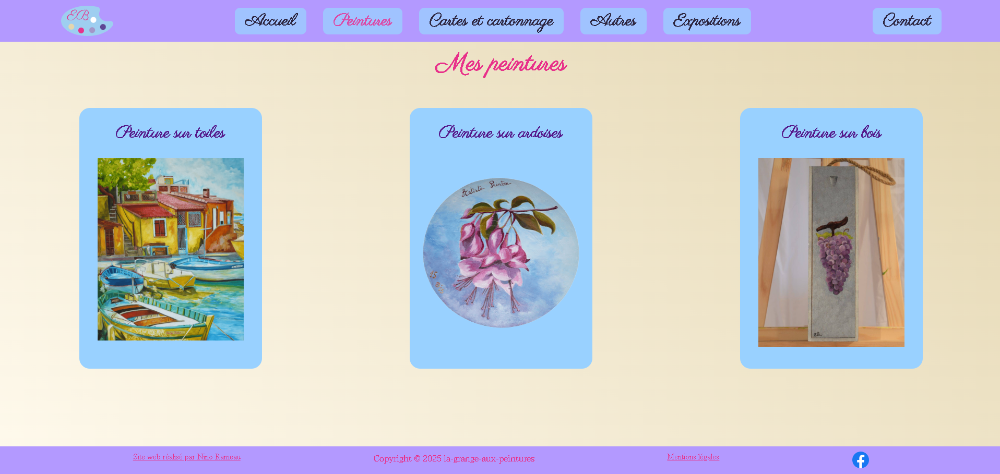

# Création d'un site vitrine

J'ai entierement réalisé ce site vitrine d'une artiste peintre.
Ainsi que la charte graphique.

## Sommaire

- [Aperçu](#aperçu)
- [Technologies utilisées](#technologies-utilisées)
- [Licence](#licence)

## Aperçu du site

## Technologies utilisées

- HTML
- CSS
- JavaScript

## Licence

Réalisation dans le cadre d'une demande en décembre 2024.
